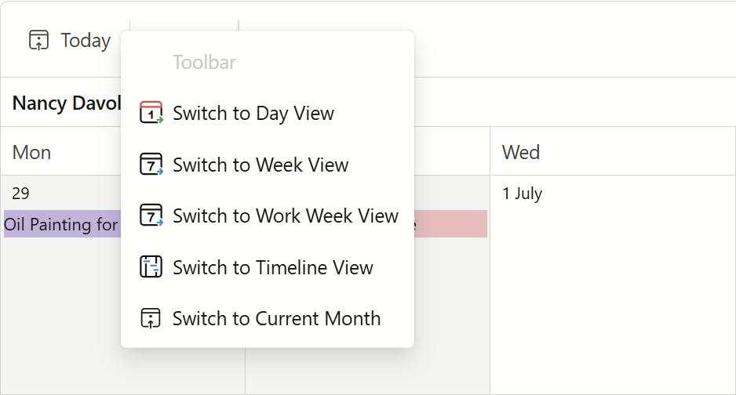
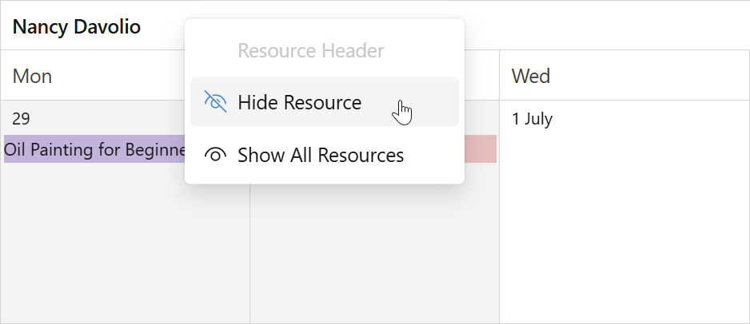

<!-- default badges list -->

[](https://supportcenter.devexpress.com/ticket/details/T1326784)
[](https://docs.devexpress.com/GeneralInformation/403183)
[](#does-this-example-address-your-development-requirementsobjectives)
<!-- default badges end -->
# Blazor Scheduler — Custom Context Menu for Scheduler Regions

This example adds a DevExpress Blazor [Context Menu](https://docs.devexpress.com/Blazor/DevExpress.Blazor.DxContextMenu) to a DevExpress Blazor [Scheduler](https://docs.devexpress.com/Blazor/DevExpress.Blazor.DxScheduler). When users right-click within any Scheduler region, the application detects the clicked region and displays a context menu with relevant commands.

| Scheduler Region | Context Menu Commands |
|---|---|
| Appointment | Edit | 
| All Day Area | Switch To Day View *(only if `ActiveViewType != Day`)* <br/> GoToToday |
| Time Cell | Go To Today <br/> Switch To Day View *(only if `ActiveViewType != Day`)* | 
| Date Header | Switch To Day View *(only if `ActiveViewType != Day`)* <br/> Go To Today |
| Day of Week Header | Go To Today | 
| Resource Header | Hide Resource *(only if visible resource count > 1)* <br/> Show All Resources | 
| Time Ruler | Toggle Work Time | 
| Toolbar | Switch To Day View *(if not `Day`)* <br/> Switch To Week View *(if not `Week`)* <br/> Switch To Work Week View *(if not `WorkWeek`)* <br/> Switch To Month View *(if not `Month`)* <br/> Switch To Timeline View *(if not `Timeline`)* <br/> Go To Today | 

The following image shows the toolbar menu:



The following image shows the resource header menu:



## Implementation Details

### Detect a Clicked Region and Show the Menu

The application uses a combination of Blazor and JavaScript to detect the clicked region and show the context menu. For [appointments](#appointments), a shared appointment template identifies the clicked appointment. For [other regions and elements](#other-regions), a JavaScript module handles the `contextmenu` event and calls back into .NET to show the menu.

If you need to add a context menu to an element that supports templates, you can use the same approach as for appointments. If you need to add a context menu to an element that does not support templates, you can use the same approach as this application uses for other regions.

#### Appointments

To detect a clicked appointment, `Index.razor` defines a shared [appointmentTemplate](CS/Components/Pages/Index.razor#L9) object. The template is reused in all Scheduler views (Day, Week, Work Week, Month, and Timeline).

Inside the template, the `context` parameter provides access to the current appointment via `context.Appointment`. The template wires the `@oncontextmenu` event and calls [ShowAppointmentContextMenu(e, context.Appointment)](CS/Components/Pages/Index.razor.cs#L99).

```Index.razor
@{
    RenderFragment<DxSchedulerAppointmentView> appointmentTemplate = context => @<div class="card @context.Label?.BackgroundCssClass">
        <div @oncontextmenu="((e) => ShowAppointmentContextMenu(e, context.Appointment))">
            @context.Appointment.Subject
        </div>
    </div>;
}
```

```Index.razor.cs
private async Task ShowAppointmentContextMenu(MouseEventArgs e, DxSchedulerAppointmentItem appointment) {
    if(ContextMenu is null || appointment is null)
        return;

    ClickedRegion = "Appointment";
    ContextMenuAppointment = appointment;
    await ContextMenu.ShowAsync(e);
}

```

#### Other Regions

The example relies on the [appointmentContextMenu.js](CS/wwwroot/js/appointmentContextMenu.js) module to process the following Scheduler regions: date header, time cell, resource header, all-day cell, and day-of-week header. The module handles the browser's `contextmenu` event, determines a region by a CSS class, and shows the appropriate menu on the .NET side of the application.

To apply custom CSS classes to the Scheduler regions, the [OnHtmlCellDecoration](CS/Components/Pages/Index.razor.cs#L160) event handler is used.

```Index.razor.cs
private void OnHtmlCellDecoration(SchedulerHtmlCellDecorationEventArgs e) {
    switch(e.CellType) {
        case SchedulerCellType.DateHeader:
            e.CssClass = "custom-date-header";
            break;
        case SchedulerCellType.TimeCell:
            e.CssClass = "custom-time-cell";
            break;
        case SchedulerCellType.ResourceHeader:
            e.CssClass = "custom-resource-header-" + e.Resources.FirstOrDefault()?.Id;
            break;
        case SchedulerCellType.AllDayTimeCell:
            e.CssClass = "custom-all-date-time-cell";
            break;
        case SchedulerCellType.DayOfWeekHeader:
            e.CssClass = "custom-day-of-week-header";
            break;
        case SchedulerCellType.None:
            e.CssClass = "custom-none";
            break;
    }
}
```

The [getRegion](CS/wwwroot/js/appointmentContextMenu.js) method determines an event target, matches region CSS classes, and passes a region name (along with an optional resource `id` and cell `start_date`) back to the Scheduler component:

```appointmentContextMenu.js
export function setup(schedulerElement, dotNetRef) {
    schedulerElement.addEventListener('contextmenu', (e) => {
        e.preventDefault();
        const region = getRegion(e.target, schedulerElement);
        if (!region) return;
        dotNetRef.invokeMethodAsync('ShowAppointmentContextMenu',
            e.clientX, e.clientY, e.pageX, e.pageY, region.name, region.id, region.start_date);
    });
}
```

When a region is detected, the module calls the [[JSInvokable] ShowAppointmentContextMenu](CS/Components/Pages/Index.razor.cs#L83) method that sets the `ClickedRegion` value and shows the menu at the cursor position.

```Index.razor.cs
[JSInvokable]
public async Task ShowAppointmentContextMenu(double clientX, double clientY, double pageX, double pageY, string region, int? id, long? startDate) {
    ClickedRegion = region;
    ClickedId = id;
    DayToGo = startDate.HasValue ? DateTimeOffset.FromUnixTimeMilliseconds(startDate.Value).DateTime : null;

    StateHasChanged();

    await (ContextMenu?.ShowAsync(new MouseEventArgs {
        ClientX = clientX,
        ClientY = clientY,
        PageX = pageX,
        PageY = pageY
    }) ?? Task.FromResult(false));
}
```

> [!NOTE]
> The [appointmentContextMenu.js](CS/wwwroot/js/appointmentContextMenu.js) module relies on DevExpress internal CSS classes (`dxbl-sc-*`, `dxbl-v-*`). They may change between versions. Review and update them when you upgrade DevExpress.Blazor.

### Region-Aware Menu Commands

[Index.razor](CS/Components/Pages/Index.razor#L83) declares a single [DxContextMenu](https://docs.devexpress.com/Blazor/DevExpress.Blazor.DxContextMenu) used for all regions. Its items are generated dynamically based on the `ClickedRegion` value. A `switch` block renders [DxContextMenuItem](https://docs.devexpress.com/Blazor/DevExpress.Blazor.DxContextMenuItem) items applicable to a clicked region and a current view. For example, "Open this day in Day View" is hidden when the Day View is active.

```Index.razor
<DxContextMenu @ref="@ContextMenu" ItemClick="@OnItemClick">
    <Items>
        <DxContextMenuItem Text="@ClickedRegion" Enabled="false" CssClass="fw-bold"></DxContextMenuItem>
        @switch (ClickedRegion)
        {
            case "Appointment":
                <DxContextMenuItem Text="Edit" Name="Edit" IconUrl="@GetMenuIcon("Edit")"></DxContextMenuItem>
                break;
            case "All Day Area":
                @if (ActiveViewType != SchedulerViewType.Day) {
                    <DxContextMenuItem Text="@OpenDayInDayViewText" Name="SwitchToDayView" IconUrl="@GetMenuIcon("SwitchToDayView")"></DxContextMenuItem>
                }
                <DxContextMenuItem Text="@GoToTodayText" Name="GoToToday" IconUrl="@GetMenuIcon("GoToToday")"></DxContextMenuItem>
                break;
            case "Time Cell":
                <DxContextMenuItem Text="@GoToTodayText" Name="GoToToday" IconUrl="@GetMenuIcon("GoToToday")"></DxContextMenuItem>
                @if (ActiveViewType != SchedulerViewType.Day) {
                    <DxContextMenuItem Text="@OpenDayInDayViewText" Name="SwitchToDayView" IconUrl="@GetMenuIcon("SwitchToDayView")"></DxContextMenuItem>
                }
                break;
            // other regions
        }
    </Items>
</DxContextMenu>
```

### Handle Context Menu Clicks

The [OnItemClick](CS/Components/Pages/Index.razor.cs#115) event handler processes item clicks based on command `Name` value:

- `Edit` — opens the appointment edit form using `ShowAppointmentEditFormAsync`.
- `SwitchToDayView` / `SwitchToWeekView` / `SwitchToWorkWeekView` / `SwitchToMonthView` — changes `ActiveViewType` and navigates to the clicked day (if available).
- `GoToToday` — resets `StartDate` to `DateTime.Today`.
- `HideResource` / `ShowAllResources` — updates the `VisibleResources` collection bound to `VisibleResourcesDataSource`.
- `ToggleWorkTime` — toggles the `ShowWorkTimeOnly` option across the views.

```Index.razor.cs
private async Task OnItemClick(ContextMenuItemClickEventArgs args) {
    switch(args.ItemInfo.Name) {
        case "Edit":
            if(Scheduler is null || ContextMenuAppointment is null)
                break;

            await Scheduler.ShowAppointmentEditFormAsync(false, ContextMenuAppointment);
            break;
        case "GoToToday":
            StartDate = DateTime.Today;
            break;
        case "SwitchToDayView":
            ActiveViewType = SchedulerViewType.Day;
            if(DayToGo is not null)
                StartDate = DayToGo.Value;
            break;
        // other commands
    }

    StateHasChanged();
}
```

## Files to Review

- [Index.razor](CS/Components/Pages/Index.razor)
- [Index.razor.cs](CS/Components/Pages/Index.razor.cs)
- [Index.razor.css](CS/Components/Pages/Index.razor.css)
- [appointmentContextMenu.js](CS/wwwroot/js/appointmentContextMenu.js)
- [Program.cs](CS/Program.cs)
- [RecurringAppointmentCollection.cs](CS/Data/RecurringAppointmentCollection.cs)
- [ResourceCollection.cs](CS/Data/ResourceCollection.cs)

## Documentation

- [DevExpress Blazor Scheduler](https://docs.devexpress.com/Blazor/DevExpress.Blazor.DxScheduler)
- [DevExpress Blazor Scheduler - Appointments](https://docs.devexpress.com/Blazor/403663/scheduler/appointments)
- [DevExpress Blazor Context Menu](https://docs.devexpress.com/Blazor/DevExpress.Blazor.DxContextMenu)
- [Call JavaScript functions from .NET methods (Microsoft)](https://learn.microsoft.com/en-us/aspnet/core/blazor/javascript-interoperability/call-javascript-from-dotnet)

## Related Examples

- [Blazor Scheduler - Get Started](https://github.com/DevExpress-Examples/blazor-scheduler-get-started)

<!-- feedback -->
## Does This Example Address Your Development Requirements/Objectives?

[](https://www.devexpress.com/support/examples/survey.xml?utm_source=github&utm_campaign=blazor-scheduler-context-menu&~~~was_helpful=yes) [](https://www.devexpress.com/support/examples/survey.xml?utm_source=github&utm_campaign=blazor-scheduler-context-menu&~~~was_helpful=no)

(you will be redirected to DevExpress.com to submit your response)
<!-- feedback end -->
